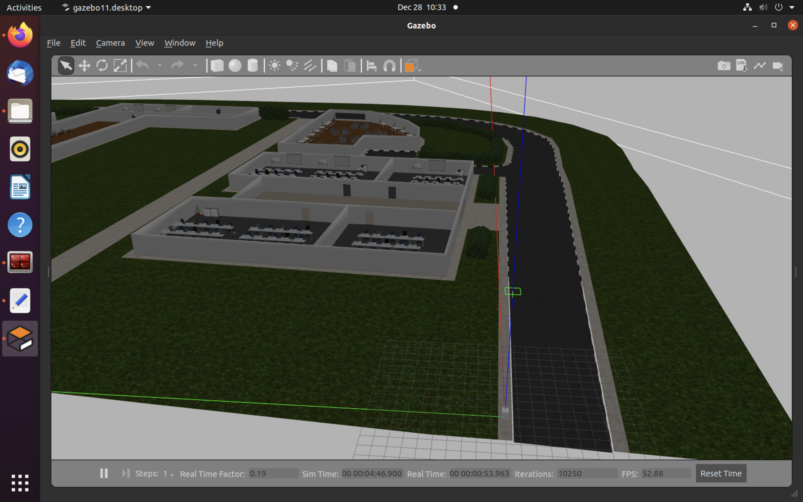

# Lane Following Gazebo Model Package

## Screenshot


## To Launch Gazebo
1. Clone this repository as a catkin package
```
cd ~/catkin_ws/src
git clone https://github.com/HelloWorldRobotics/tars5_6.git
```

2. Move "Campus" directory to upper directory (same level as tar5_6)
```
cd tars5_6
mv ./Campus ../
```

3. Catkin Build
```
cd ~/catkin_ws
catkin_make
source devel/setup.bash
```

4. Launch gazebo world
```
roslaunch tars5_6 gazebo.launch
```

## To Run Real Time Inference
1. Make sure trained model is loaded in the path `./Pytorch-UNet/gazebo_MODEL.pth`

2. Make python file executable
```
chmod a+x ~/catkin_ws/src/tars5_6/Pytorch-UNet/predict.py
```

3. Run `predict.py` in workspace
```
cd catkin_ws
rosrun tars5_6 predict.py
```
